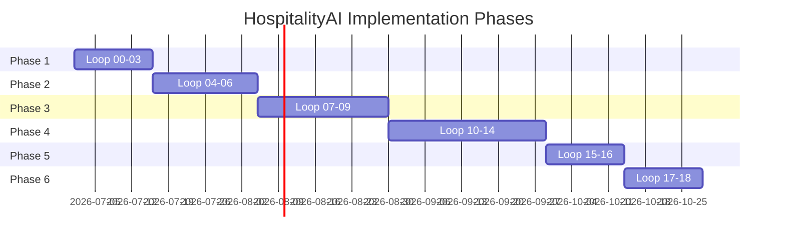

# Product Roadmap

The development of HospitalityAI is structured into six milestone-based phases.

---

## Phase 1: Foundation and Domain Design (Milestone 1)
- **Loops Covered**: Loop 00 to Loop 03.
- **Deliverables**: Engineering constitution, coding guidelines, product requirements documents (PRD), system architecture specs, ADR files, bounded contexts definition, and ubiquitous glossary.

## Phase 2: Core Platform & Databases (Milestone 2)
- **Loops Covered**: Loop 04 to Loop 06.
- **Deliverables**: Repository bootstrapping, directory layout setup, docker-compose orchestration, database schemas (PostgreSQL), migration history (Alembic), seed sets, and base repository persistence classes.

## Phase 3: AI, Agents and Knowledge (Milestone 3)
- **Loops Covered**: Loop 07 to Loop 09.
- **Deliverables**: AI platform gateways (adapters for Gemini/Claude/OpenAI), prompt template configurations, multi-agent frameworks (LangGraph orchestration), tool registries, semantic chunkers, document parser workflows, and Qdrant integration.

## Phase 4: Business Platforms (Milestone 4)
- **Loops Covered**: Loop 10 to Loop 14.
- **Deliverables**: Reservation planner service, guest experience assistant, housekeeping tracking automation, revenue forecasting ML service, reviews sentiment log, and executive reports engine.

## Phase 5: Dashboard and Administration (Milestone 5)
- **Loops Covered**: Loop 15 to Loop 16.
- **Deliverables**: Analytics front-end dashboard, real-time KPI graphs, JWT authentication middlewares, and role-based access checkers.

## Phase 6: Production Engineering and Validation (Milestone 6)
- **Loops Covered**: Loop 17 to Loop 18.
- **Deliverables**: Performance optimizations, CI/CD pipelines, E2E validation tests, and v1.0 release packaging.
