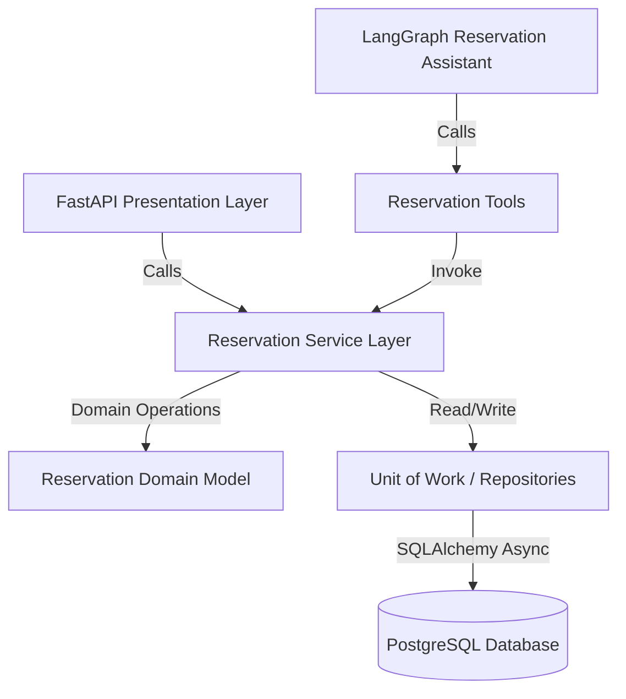

# RFC-0006: Intelligent Reservation Platform Design

- **Author**: Antigravity AI Coding Agent
- **Status**: Draft
- **Date**: 2026-07-06
- **Target Release/Loop**: Loop 10

## 1. Summary

This RFC proposes the architecture and design of the Intelligent Reservation Platform for HospitalityAI. The platform provides core booking management capabilities, availability search, pricing logic, room allocation, and conversational reservation assistance powered by a multi-agent system (LangGraph).

## 2. Background and Business Context

A reservation is a core business entity in hotel operations. The platform must move beyond basic CRUD operations to provide an intelligent, automated experience:
- Validate stay intervals and room occupancies.
- Handle complex, dynamic pricing rules (seasonal base rates, weekend markups, loyalty discounts).
- Implement optimized room allocation algorithms to prevent overbooking and honor guest preferences.
- Provide a natural language booking assistant using tool-based orchestration rather than simple prompting.

## 3. Proposed Design & Architecture

We propose introducing a decoupled `business/reservation/` package containing the core domain logic, fully isolated from framework dependencies.

### System Topology / Diagram

### Components Layout
- `domain/`: Entities, Value Objects (`BookingWindow`, `GuestPreferences`), and Enums (`ReservationStatus`).
- `services/`: Core application services (`ReservationService`, `AvailabilityService`, `PricingService`, `AllocationService`, `CancellationService`, `ReservationHistoryService`, `NotificationService`).
- `pricing/`: Base rates and multiplier engines.
- `allocation/`: Logic for assigning rooms and handling upgrades.
- `workflows/`: LangGraph definitions mapping state transitions.
- `api/`: Controllers mapping REST requests to application services.

### API Design
- **`POST /api/v1/reservations`**: Create a new reservation.
  - Payload: `{ guest_id: UUID, room_category_id: UUID, check_in_date: date, check_out_date: date, preferences: dict }`
  - Response: `201 Created` with Reservation details.
- **`GET /api/v1/reservations/{id}`**: Retrieve reservation status.
- **`PUT /api/v1/reservations/{id}`**: Modify reservation dates/category.
- **`DELETE /api/v1/reservations/{id}`**: Cancel reservation.
- **`POST /api/v1/reservations/search`**: Advanced search on reservations.
- **`POST /api/v1/reservations/availability`**: Query available categories and alternative options.
- **`POST /api/v1/reservations/chat`**: Direct interaction with the LangGraph Reservation Assistant.

### Data Persistence
We will leverage existing database tables (`reservations`, `rooms`, `room_categories`, `guests`) and introduce:
- `reservation_history`: For auditing status changes and upgrades.
  - Fields: `id` (UUID), `reservation_id` (UUID), `old_status` (str), `new_status` (str), `changed_by` (UUID), `reason` (str), `timestamp` (datetime).

### LangGraph Agent and Tool Workflows
The conversational reservation assistant will use LangGraph to orchestrate workflows. Six tools will be registered with the `ToolExecutor`:
1. `SearchAvailabilityTool`: Queries available room categories.
2. `CalculatePriceTool`: Estimates dynamic rates including seasonal rules.
3. `ReserveRoomTool`: Places room bookings.
4. `ModifyReservationTool`: Updates booking schedules.
5. `CancelReservationTool`: Cancels active bookings.
6. `RecommendUpgradeTool`: Recommends room upgrades for VIP guests.

## 4. Security & Compliance
- Enforce JWT sub check verifying guests can only modify their own data.
- Restrict room allocation and override features to `Staff` or `Manager` roles.
- Use parameterized SQLAlchemy queries to prevent SQL injections.

## 5. Testing & Validation Plan
- **Unit Tests**:
  - Date overlap and booking window validation algorithms.
  - Pricing policy math (standard rates, seasonal peak, and weekend markups).
- **Integration Tests**:
  - Concurrent booking execution checks verifying transactional database locks.
  - FastAPI endpoint response schemas validations.
- **Agent Evaluations**:
  - LLM tool-calling reliability validations under LangGraph workflows.
- **Target Coverage**: >= 95%

## 6. Alternatives Considered
- **Direct Controller Logic**: Rejected to adhere to Rule 7 (Business logic never lives in controllers) and maintain clean onion-style layers.
- **Prompt-Only Assistant**: Rejected in favor of LangGraph workflow nodes to ensure deterministic execution pathways (Rule 16).
