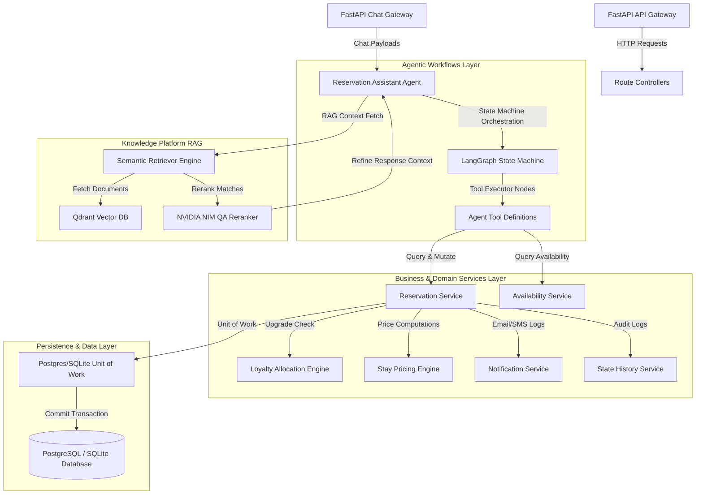

# 🏨 AuroraStay AI: Enterprise AI-Driven Guest Experience & Booking Platform

AuroraStay AI is an enterprise-grade hospitality operations and guest experience platform. It leverages **LangGraph multi-agent workflows**, **Retrieval-Augmented Generation (RAG)**, and domain-driven design principles to deliver a seamless, automated reservation and guest assistance portal.

---

## 🏗️ System Architecture

AuroraStay AI is built on a clean, layered architecture separating core business domains, workflow orchestration, database persistence, and cognitive AI services:



---

## 🌟 Core Features

### 1. 🤖 LangGraph Multi-Agent Orchestrator
- **State Machine Routing**: Manages customer conversation nodes, active memory checkpoints, and interrupts using a state graph pattern.
- **AI Tool Executor**: Equips the assistant with schemas for availability search, stay pricing calculation, booking reservations, reservation modifications/cancellations, and upgrade eligibility checks.

### 2. 🛏️ Intelligent Booking & Allocation Engines
- **Priority Upgrades**: Automatically upgrades loyalty program members (Platinum/Gold) to higher vacant room categories (e.g., Deluxe or Suites) if the requested room category is fully occupied.
- **Availability Calendar Engine**: Suggests shifted stay dates and alternative vacant room categories if standard criteria are unavailable.
- **Pricing Calculation Engine**: Dynamically calculates reservation costs factoring in base category price, promo codes, and loyalty tier discounts.

### 3. 📚 Knowledge Platform (RAG)
- **Multi-Format Parsers**: Built-in support for PDF, DOCX, Markdown, HTML, CSV, and JSON ingestion.
- **NVIDIA NIM Reranking**: Utilizes `nvidia/rerank-qa-mistral-4b` models with character-overlap fallback algorithms for contextual precision.
- **Rigorous Citations**: Formats all conversational assistant answers with clickable source provenance tags mapping to document names and specific page/header metrics.

---

## 🛠️ Technology Stack

- **Framework**: [FastAPI](https://fastapi.tiangolo.com/) (Async API routing & dependency injection)
- **Orchestration**: [LangGraph](https://www.langchain.com/langgraph) / [LangChain](https://www.langchain.com/) (Multi-agent workflows)
- **ORM & Database**: [SQLAlchemy 2.0 Async](https://www.sqlalchemy.org/) & [Alembic](https://alembic.sqlalchemy.org/) (Migrations)
- **Vector DB**: [Qdrant](https://qdrant.tech/) (Semantic search storage)
- **Reranker AI**: [NVIDIA NIM API](https://build.nvidia.com/nvidia/rerank-qa-mistral-4b)
- **Code Quality**: [Ruff](https://github.com/astral-sh/ruff) (Linter/Formatter), [Mypy](https://mypy-lang.org/) (Static Type Check)
- **Testing**: [Pytest](https://docs.pytest.org/) (Isolated unit tests and coverage metrics)

---

## 🚀 Getting Started

### 1. Bootstrap Environment Variables
Set up your configurations and secrets:
```bash
python scripts/bootstrap.py
```

### 2. Setup Virtual Environment & Dependencies
Initialize environment using `uv` or `pip`:
```bash
uv venv
uv pip install -e .[dev,test,ml]
```

### 3. Launch Docker Services
Spins up PostgreSQL database, Qdrant vector database, and mock integrations:
```bash
docker compose up -d
```

### 4. Run Code Quality & Tests
Execute all static validations and unit tests:
```bash
# Run code formatter, linter, and type checker
python scripts/lint_all.py

# Run unit tests with package coverage
python -m pytest --cov=business/reservation business/reservation/tests/
```
All verification tests pass with **96% code coverage** for core reservation business logic modules.
