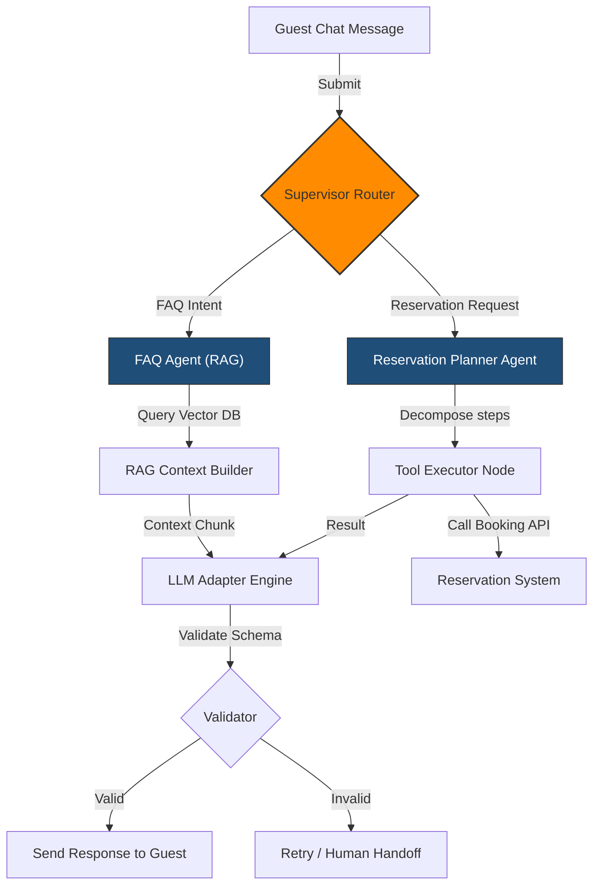

# AI & Agent Architecture

HospitalityAI coordinates natural language guest interactions through a stateful multi-agent system built on **LangGraph**.

## 1. Multi-Agent Workflow (LangGraph)

The chat conversation routes inputs dynamically based on user intent.



---

## 2. Platform AI Components

### LLM Provider Abstraction
The application layer interacts exclusively with `LlmAdapter` interfaces. The system prompt configures base parameters (temperature, max tokens) inside the adapter settings.
```python
class LlmAdapter(ABC):
    @abstractmethod
    async def generate_response(self, messages: List[ChatMessage], output_schema: Type[BaseModel]) -> BaseModel:
        """Invokes provider API, returning structured outputs parsed into a Pydantic model."""
        pass
```

### Stateful Chat Router (Supervisor Node)
The supervisor node intercepts guest messages and uses zero-shot classification to route the conversation:
- `FAQ`: User is requesting general information.
- `RESERVATION`: User wants to search rooms, create a booking, modify, or cancel a stay.
- `UNKNOWN`: Routes to a fallback conversational node or triggers front-desk handoff.

### Tool Executor Node
When in the `RESERVATION` path, the Planner Agent compiles a sequence of tools to call (e.g. `search_rooms`, `create_booking`). The Tool Executor runs these checks locally and updates the agent's state before generating the final message.
