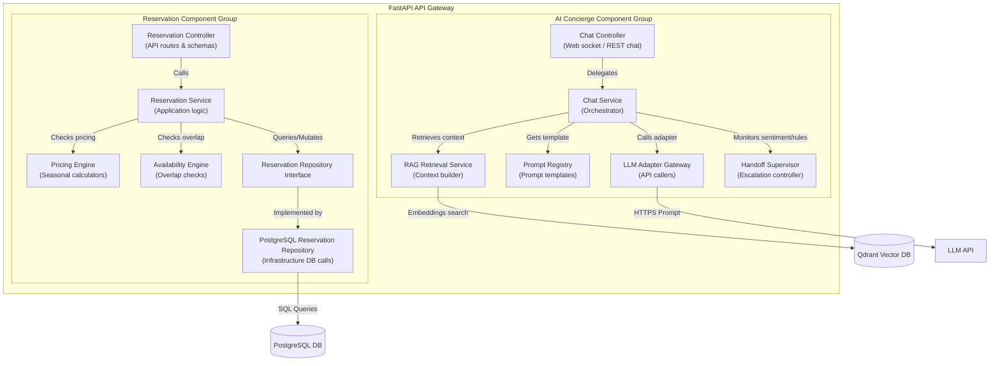

# Component Diagram (C4 Level 3)

This component diagram zooms into the internal components of the **Reservations** and **AI Concierge** services inside the API Gateway and Business Core containers.

## 1. Component Diagram

## 2. Component Descriptions

### Reservations Group
- **Reservation Controller**: Declares REST endpoints (e.g. `POST /api/v1/reservations/`). Validates payloads using Pydantic models and parses date objects.
- **Reservation Service**: Coordinates core reservation use cases. Dictates transactional database scopes, checks room capacities, and raises domain errors.
- **Pricing Engine**: Extends reservations business logic by calculating total booking rates, factoring in base costs, days of the week, and holiday multipliers.
- **Availability Engine**: Checks inventory capacity for the check-in and check-out dates, preventing overbooking.
- **Reservation Repository**: Encapsulates DB details. Declares abstract SQL interfaces to maintain database independence.
- **PostgreSQL Reservation Repository**: Implements SQL database access utilizing SQLAlchemy async methods.

### AI Concierge Group
- **Chat Controller**: Handles WebSocket or polling REST requests for the chat widget.
- **Chat Service**: Manages stateful conversational logic, merging user input, history, and retrieved context.
- **RAG Retrieval Service**: Interacts with the Vector database to search, retrieve, and format the context blocks needed for prompt completion.
- **Prompt Registry**: System asset repository containing modular, version-controlled prompt files (YAML or text format).
- **LLM Adapter Gateway**: Translates structured system prompts into provider-specific API calls, handling error retry flows.
- **Handoff Supervisor**: Intercepts chat pipelines to check for angry sentiment, agent loops, or explicit human requests, triggering receptionist queues.
