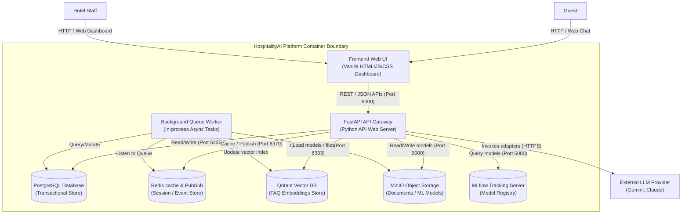

# Container Diagram (C4 Level 2)

This container diagram details the architectural components (containers) within the HospitalityAI platform boundaries, demonstrating the database, storage, and caching subsystems.

## 1. Container Diagram

## 2. Container Descriptions and Communications

- **Frontend Web UI**: Client-side application rendering the analytics dashboard and guest chat widget. Communicates with the API gateway via HTTPS REST requests.
- **FastAPI API Gateway**: Runs the core web service. Handles authentication, delegates bookings to application modules, forwards vector requests, and issues async tasks.
- **Background Queue Worker**: Processes asynchronous background events (e.g. training prediction models, document chunk processing, housekeeping task generation) via Redis-backed task loops.
- **PostgreSQL Database**: The relational transactional persistence engine. Holds guest profiles, reservation calendar records, room details, and housekeeping logs.
- **Redis Cache & Pub/Sub**: Manages transient session states, active user keys, chat window histories, and inter-service messaging queues.
- **Qdrant Vector DB**: Powers retrieval-augmented generation (RAG) by storing high-dimensional semantic FAQ document embeddings.
- **MinIO Object Storage**: S3-compatible local bucket storing static documents, raw reviews for pipelines, and pickled machine learning models.
- **MLflow Tracking Server**: Tracks model runs, loss histories, and manages forecasting deployment model registries.
- **External LLM Provider**: Process chat contexts via API adapters.
