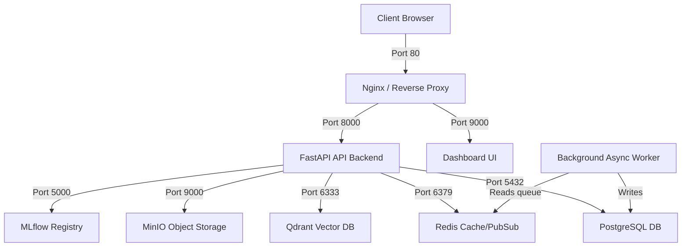

# Deployment Architecture

HospitalityAI leverages Docker containers for local development, staging, and production hosting. A single, unified `docker-compose.yml` orchestrates the local stack.

## 1. Container Topology



---

## 2. Container Ports and Services Table

| Service Name | Container Image | Port (External:Internal) | Purpose |
| --- | --- | --- | --- |
| **`api`** | `python:3.12-slim` (Custom Build) | `8000:8000` | Exposes REST APIs and routes requests to business services. |
| **`worker`** | `python:3.12-slim` (Custom Build) | None | Background task processor executing ETL and ML model training. |
| **`db`** | `postgres:16-alpine` | `5432:5432` | Primary database storing structured reservations, tasks, and users. |
| **`redis`** | `redis:7-alpine` | `6379:6379` | Handles chat histories, token caches, and pub/sub events. |
| **`qdrant`** | `qdrant/qdrant:v1.9.0` | `6333:6333` | Stores high-dimensional vector search points for RAG. |
| **`minio`** | `minio/minio` | `9000:9000` & `9001:9001` (console) | Handles local S3 buckets (FAQ PDF storage, MLflow model binary drops). |
| **`mlflow`** | `ghcr.io/mlflow/mlflow` | `5000:5000` | Logs model params and coordinates the active forecasting model registry. |

---

## 3. System Bootstrap Sequence

To launch the stack, developers run:
```bash
docker compose up -d
```

The services boot in the following order (governed by compose `depends_on` check structures):
1. **Infrastructure**: `db`, `redis`, `qdrant`, `minio` start up first.
2. **Support Platform**: `mlflow` boots once `minio` and `db` connections are established.
3. **Application Layer**: `api` and `worker` start once `db`, `redis`, and `qdrant` health checks report ready.
