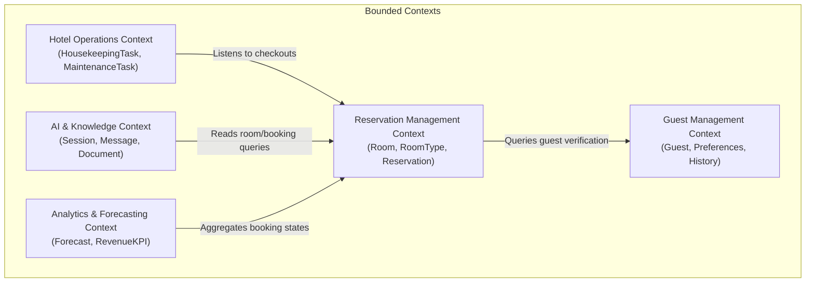

# Domain Boundaries & Bounded Contexts

HospitalityAI follows Domain-Driven Design (DDD) principles. The domain model is partitioned into distinct **Bounded Contexts** to prevent database leaking, domain overlap, and architectural complexity.

## 1. Bounded Context Map

---

## 2. Bounded Context Specifications

### Guest Management Context
- **Responsibilities**: Registration, guest preferences profile, CRM contacts, and historical loyalty data.
- **Aggregates & Entities**:
  - `Guest` (Root Entity)
  - `GuestProfile` (Entity)
  - `Preferences` (Value Object: room temperature, pillow preferences)

### Reservation Management Context
- **Responsibilities**: Room inventories, stay calendars, night rates calculations, and booking statuses.
- **Aggregates & Entities**:
  - `Reservation` (Root Entity)
  - `Room` (Entity)
  - `RoomType` (Entity)
  - `DateRange` (Value Object: checkin, checkout dates)
  - `PriceRate` (Value Object: amount, currency)

### Hotel Operations Context
- **Responsibilities**: Service tasks, housecleaning rosters, facilities cleaning schedules, and maintenance repairs.
- **Aggregates & Entities**:
  - `HousekeepingTask` (Root Entity)
  - `MaintenanceTask` (Entity)
  - `TaskStatus` (Value Object: Pending, In Progress, Complete)
  - `Employee` (Entity)

### AI & Knowledge Context
- **Responsibilities**: Stateful guest chat widgets, embeddings lookup, FAQ vector mapping, and conversational history cache.
- **Aggregates & Entities**:
  - `ChatSession` (Root Entity)
  - `Message` (Entity)
  - `KnowledgeDocument` (Root Entity)
  - `Chunk` (Entity)
  - `VectorEmbedding` (Value Object)

### Analytics & Forecasting Context
- **Responsibilities**: Occupancy predictions, pricing recommendations, review sentiment logs, and daily metrics summaries.
- **Aggregates & Entities**:
  - `ForecastModel` (Root Entity)
  - `OccupancyPacing` (Value Object)
  - `ReviewSentiment` (Entity)
