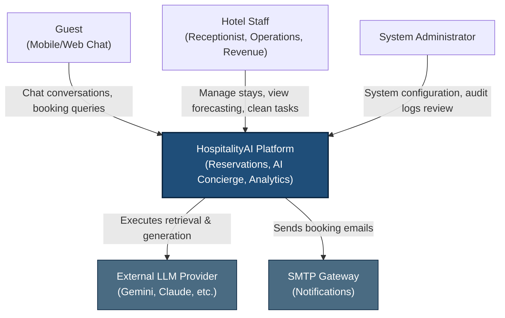

# System Context (C4 Level 1)

This system context diagram maps the boundaries of the HospitalityAI system, indicating the target users and external integrations.

## 1. Context Diagram

## 2. Interaction Descriptions

- **Guest**: Uses natural language chat to ask FAQs, search availability, and place room reservations. Receives booking confirmations via SMTP.
- **Hotel Staff**:
  - **Receptionist**: Interacts with the booking engine to manage walk-ins and takes over chat sessions escalated by the AI Concierge.
  - **Operations Manager**: Monitors real-time housekeeping queues and reviews sentiment logs.
  - **Revenue Manager**: Views occupancy forecasts and adjusts pricing settings.
- **System Administrator**: Adjusts credentials, monitors log telemetry, and configures role-based tokens.
- **External LLM Provider**: Process prompts and returns structured text or JSON entities (accessed via adapters in the `ai/` platform).
- **SMTP Gateway**: Sends confirmation messages to guests upon reservation completion or changes.
