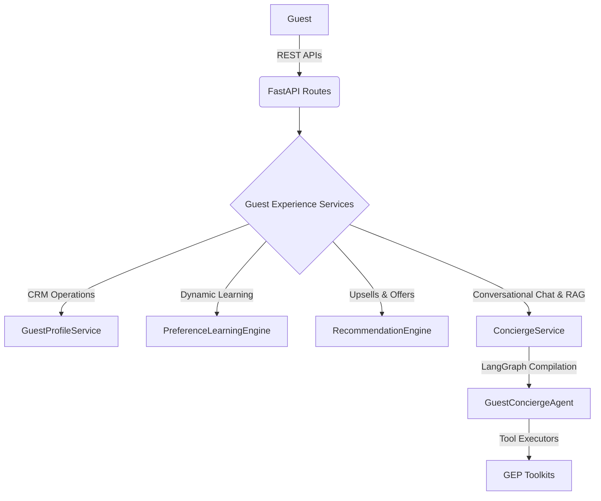

# Guest Experience Platform (GEP)

The **Guest Experience Platform (GEP)** is a key subsystem of AuroraStay-AI, responsible for managing guest lifecycle, tracking and learning guest preferences from conversational interactions, serving recommendations/upsells, and orchestrating guest concierge communication using RAG and autonomous AI Agent workflows.

## System Architecture

## Component Breakdown

1. [Guest Profiles & CRM](guest-profile.md)
   Provides secure, persistent management of Guest details, CRM states, and loyalty tier transitions (Bronze, Silver, Gold, Platinum, VIP).
2. [Preference Learning Engine](conversation-memory.md)
   Implicitly and dynamically extracts guest preferences (room layout, pillow choices, dietary constraints) from conversational inputs.
3. [Recommendation Engine](recommendations.md)
   Generates personalized spa sessions, dining recommendations, and loyalty-based room upgrades.
4. [AI Concierge Service](concierge.md)
   Coordinates multi-turn chat sessions, integrates a semantic RAG pipeline for hotel policy lookups, and manages staff handoffs.
5. [Agent Workflows](guest-workflows.md)
   Executes autonomous planning, step execution, and agent task scheduling using the LangGraph engine.
6. [API Specifications](api.md)
   Provides complete Swagger/OpenAPI endpoint documentation for guest resource integration.
