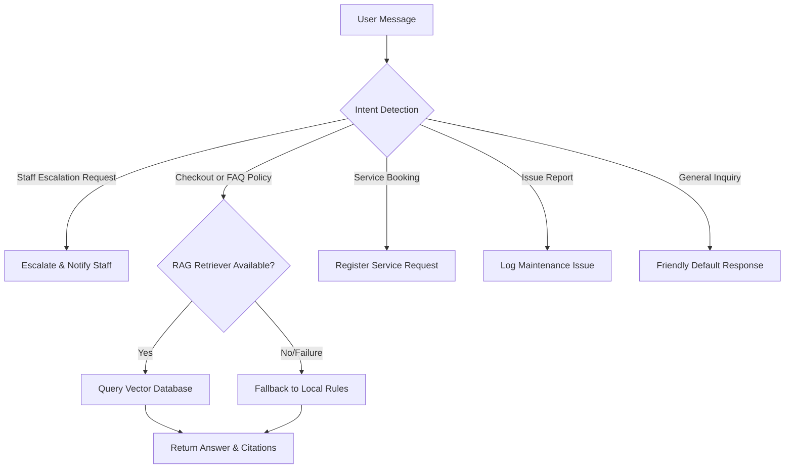

# AI Concierge Service

The AI Concierge Service provides a unified interface for handling real-time, multi-turn guest conversation. It integrates local intent routing with semantic Retrieval-Augmented Generation (RAG) to resolve queries.

## Query Handling Flow

## Vector Search & Fallbacks
If the RAG retrieval fails or the knowledge platform database times out, the service falls back to local rules to answer standard hotel policies (e.g. check-in is at 3:00 PM, check-out is at 11:00 AM) to maintain operational availability.

## Conversation Memory
All messages are logged inside a structured JSON timeline in the `Conversation` database table, enabling continuous context across web, mobile, and voice channels.
