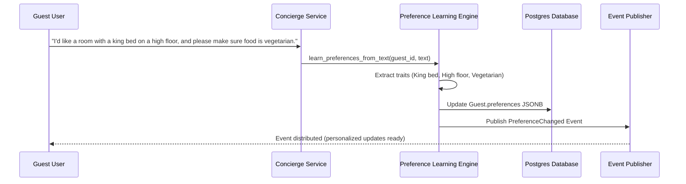

# Conversation Memory & Preference Learning

The **Preference Learning Engine** dynamically extracts guest choices from conversational text. This eliminates manual configuration, providing a seamless guest experience.

## Extractable Traits

1. **Room Layout**:
   - Matches keywords: `"king bed"`, `"king size"`, `"queen bed"`, `"high floor"`, `"upper floor"`, `"low floor"`.
2. **Pillow Preferences**:
   - Matches keywords: `"feather pillow"`, `"memory foam pillow"`, `"foam pillow"`.
3. **Dietary Restrictions**:
   - Matches keywords: `"vegetarian"`, `"vegan"`, `"gluten free"`, `"gluten-free"`.

## Architecture Diagram

