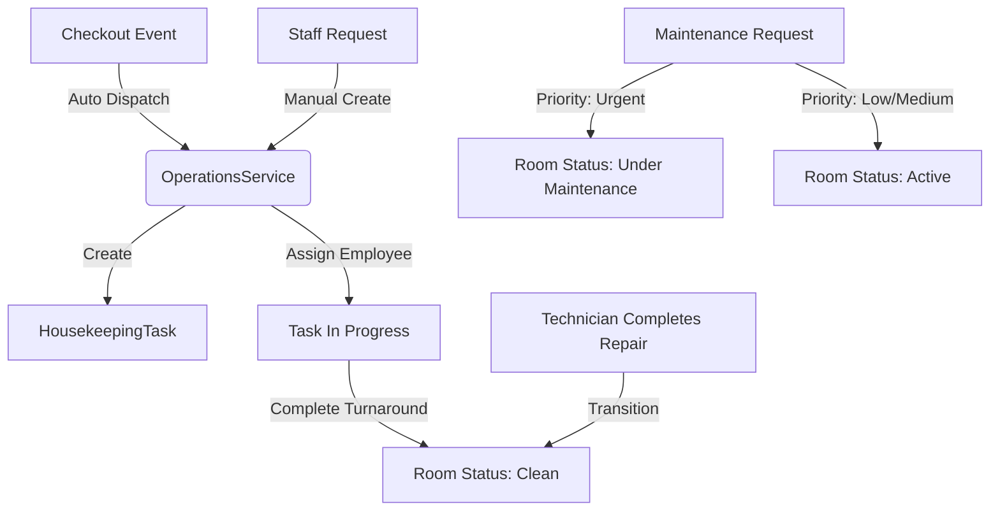

# Hotel Operations Platform (HOP)

The **Hotel Operations Platform (HOP)** manages physical hotel logistics: room turnaround housekeeping activities, resource assignments, and maintenance repair work orders.

## Architecture & Workflows

## Platform Elements

1. [Housekeeping Tracking](housekeeping.md)
   Details turnaround logistics, checkout hooks, status tracking, and employee assignments.
2. [Maintenance Management](maintenance.md)
   Documents work order priorities (`LOW`, `MEDIUM`, `URGENT`), and target room state transitions.
3. [API Specifications](api.md)
   Exposes complete REST endpoints reference grid for operations integrations.
