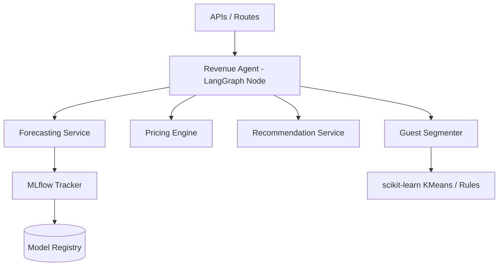

# Revenue Intelligence Platform

Welcome to the Revenue Intelligence Platform documentation. This module contains all tools, engines, pipelines, and AI agents for forecasting demand, determining dynamic pricing, profiling guest segments, and suggesting up-sells/cross-sells to maximize profitability.

## Directory Map

- [Dynamic Pricing Engine](pricing.md): Describes markup calculation rules and standard loyalty discounts.
- [Occupancy & Demand Forecasting](forecasting.md): Details configurable-horizon occupancy, demand, and revenue projection algorithms.
- [Guest Segmentation](guest-segmentation.md): Outlines guest clustering logic (KMeans + rules) and segment definitions.
- [Personalized Upsell/Cross-sell](recommendations.md): Explains recommendation engines for upgrades and ancillary items.
- [Decision Intelligence Node / Agent](decision-agent.md): Describes the LangGraph agent state machine that orchestrates retrieval, decision framing, and explanation.
- [Model Monitoring & Pipelines](model-monitoring.md): Outlines ML training, registry (MLflow), promotion/rollback strategies, and drift detection.
- [Business Impact & KPIs](business-impact.md): Details the dynamic KPIs tracked by the platform.

## Architecture Diagram

## Mounting and Setup
The endpoints are mounted under the `/revenue` prefix in the main application router. They can be queried directly via REST requests.
