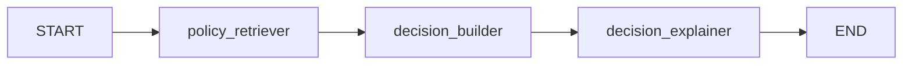

# Decision Intelligence Agent

The `RevenueAgent` utilizes a `LangGraph` state engine to orchestrate the retrieval of policies, execution of the pricing engine, and natural language explanations.

## Graph State Definition
The workflow transitions state through the `AgentState` TypedDict:
- `room_category_id`: Target room category.
- `target_date`: Forecast timestamp.
- `occupancy_ratio`: Forecasted occupancy.
- `is_peak_season`: Seasonality flag.
- `policy_docs`: Content queried from the Knowledge Platform.
- `decision_package`: Structured pricing strategy.
- `explanation`: Human-friendly explanation.

## Graph Node Pipeline

### 1. Policy Retriever
Queries the Knowledge Platform RAG retriever for pricing limits and markup caps. If RAG is unavailable, falls back to a default cap (e.g. 30%).

### 2. Decision Builder
Invokes the pricing engine, caps recommended markups, estimates the business impact, and packages alternatives.

### 3. Decision Explainer
Generates natural language reasoning explaining why the recommendation was made.
