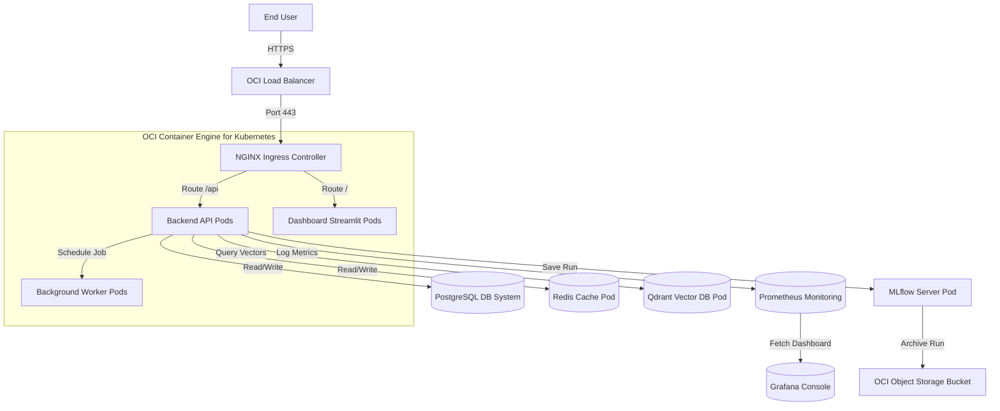

# Production Engineering, Cloud Deployment & Platform Reliability

This directory contains system documentation for cloud provisioning, deployments automation, and reliability engineering on Oracle Cloud Infrastructure (OCI).

## Platform Architecture

## Deployment Reference Files

1. **[Production Cloud Architecture](production-architecture.md)**: High-level design separating networks, subnets, and compute.
2. **[CI/CD Pipelines Documentation](ci-cd.md)**: Git-driven integration checks, security container scans, and promotion stages.
3. **[Kubernetes Container Orchestration](kubernetes.md)**: Specifications of Pod manifests, liveness/readiness indicators, and persistent storages.
4. **[Terraform Infrastructure as Code](terraform.md)**: Declarative OCI resource configurations.
5. **[Release Management & Rollback](release-process.md)**: Semantic versioning, blue-green upgrades, and automatic triggers.
6. **[Database & State Backups](backup-recovery.md)**: pg_dump scripts, Qdrant snapshots, and object bucket synchronizations.
7. **[Workloads Scaling & Resources](scaling.md)**: Configured limits and metrics governing HPAs.
8. **[Service Reliability & Graceful Exit](reliability.md)**: Graceful shutdown timeouts and SIGTERM event handling.
