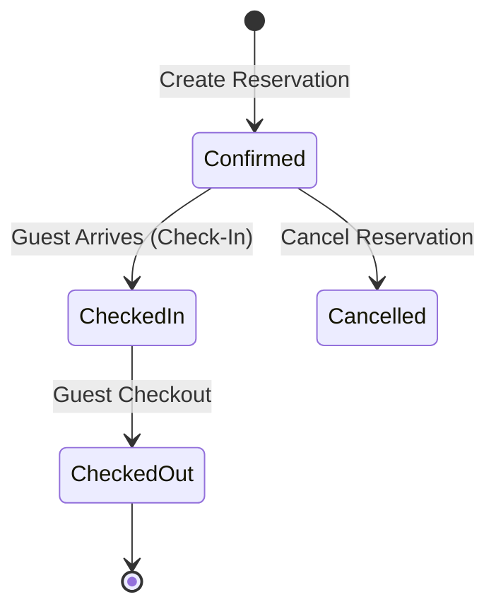
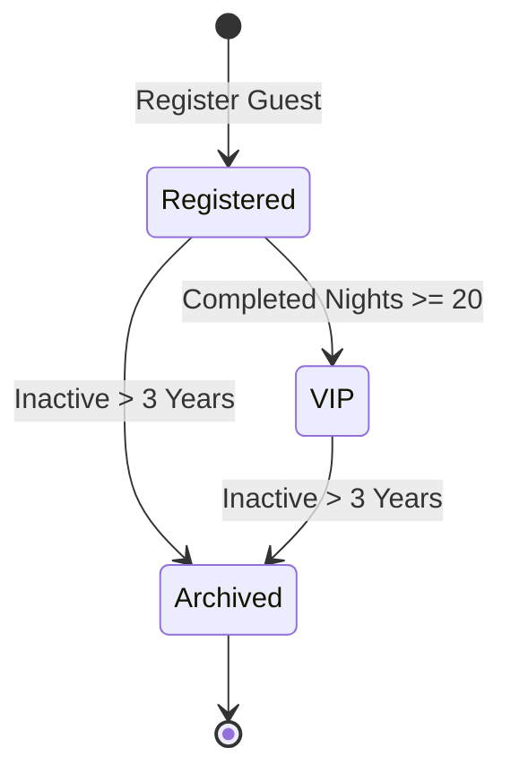
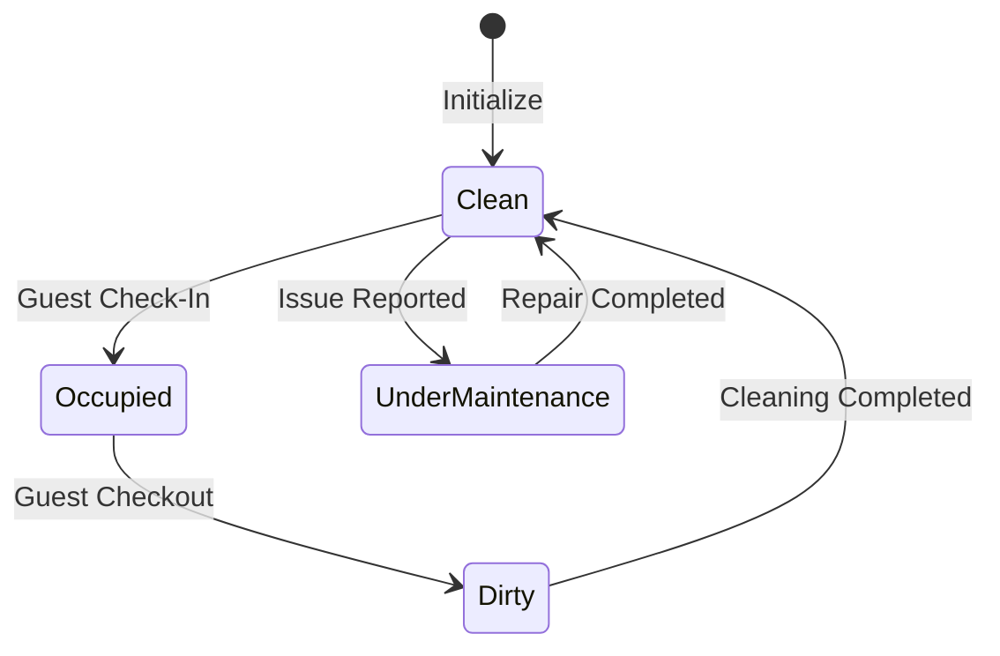
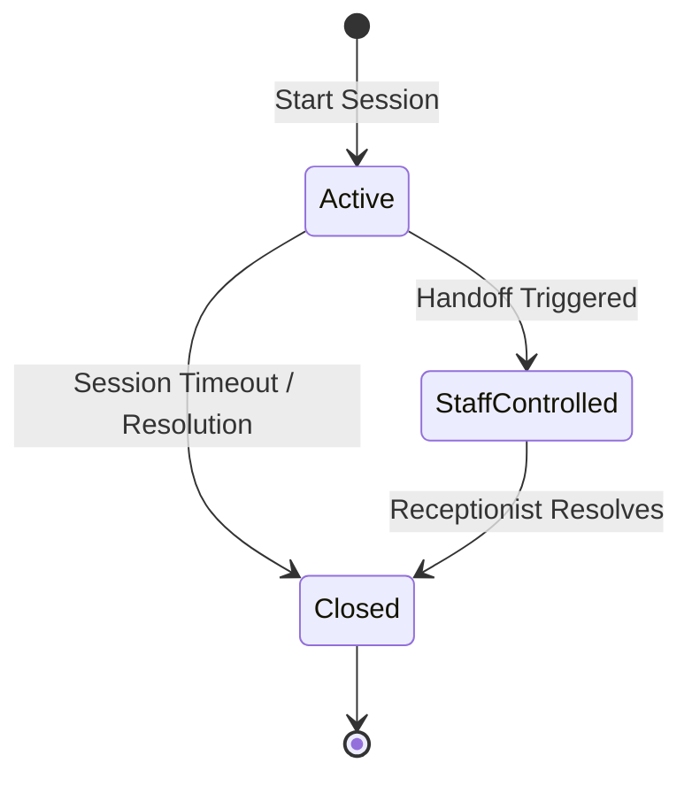

# Aggregate Roots and Lifecycles

This document outlines the Aggregate Roots of HospitalityAI, specifying their child entities, value objects, business invariants, and lifecycle state transitions.

---

## 1. Reservation Aggregate

- **Aggregate Root**: `Reservation`
- **Child Entities**: `Room` (Reference), `Guest` (Reference)
- **Value Objects**: `DateRange`, `Money` (Total cost), `ReservationStatus` (Value Object enum)
- **Business Invariants**:
  - `DateRange` duration must be $\ge 1\text{ night}$.
  - A reservation cannot transition to `CheckedIn` before its `DateRange.start` date.
  - Total pricing cost must equal the sum of night rates for the chosen room category.
- **State Transitions Flowchart**:

- **Domain Events**: `ReservationCreated`, `GuestCheckedIn`, `GuestCheckedOut`, `ReservationCancelled`.

---

## 2. Guest Aggregate

- **Aggregate Root**: `Guest`
- **Child Entities**: `GuestProfile`
- **Value Objects**: `GuestPreference` (room temp, pillow type), `LoyaltyTier` (Bronze, Silver, Gold, VIP), `LanguagePreference`.
- **Business Invariants**:
  - Guest profile must contain a verified contact identifier (phone or email).
  - Loyalty tier transitions are calculated based on historical completed room nights.
- **State Transitions Flowchart**:

- **Domain Events**: `GuestRegistered`, `GuestLoyaltyUpgraded`.

---

## 3. Room Aggregate

- **Aggregate Root**: `Room`
- **Child Entities**: None.
- **Value Objects**: `RoomNumber`, `RoomStatus` (Clean, Dirty, Under Maintenance), `RoomCategory`.
- **Business Invariants**:
  - Rooms cannot be assigned to arriving guests if status is `Dirty` or `Under Maintenance`.
- **State Transitions Flowchart**:

- **Domain Events**: `RoomAssigned`, `RoomReleased`, `RoomStatusChanged`.

---

## 4. Housekeeping Task Aggregate

- **Aggregate Root**: `HousekeepingTask`
- **Child Entities**: `Employee` (Assignee reference)
- **Value Objects**: `TaskStatus` (Pending, In Progress, Complete), `RoomNumber`.
- **Business Invariants**:
  - A task cannot be marked `Complete` unless an assignee `Employee` is registered.
- **Domain Events**: `HousekeepingTaskCreated`, `HousekeepingTaskCompleted`.

---

## 5. Maintenance Request Aggregate

- **Aggregate Root**: `MaintenanceRequest`
- **Child Entities**: `Employee` (Assignee reference)
- **Value Objects**: `TaskStatus`, `RoomNumber`, `Priority` (Low, Medium, Urgent).
- **Business Invariants**:
  - Urgent requests place the target room into the `UnderMaintenance` state immediately.
- **Domain Events**: `MaintenanceRequested`, `MaintenanceCompleted`.

---

## 6. Recommendation Aggregate

- **Aggregate Root**: `Recommendation`
- **Child Entities**: None.
- **Value Objects**: `ConfidenceScore`, `RecommendationType` (Price, Upgrade).
- **Business Invariants**:
  - `ConfidenceScore` must be a value between `0.0` and `1.0`.
- **Domain Events**: `RecommendationGenerated`.

---

## 7. Conversation Aggregate

- **Aggregate Root**: `ChatSession`
- **Child Entities**: `Message` (List of exchange messages)
- **Value Objects**: `SessionStatus` (Active, Staff-Controlled, Closed).
- **Business Invariants**:
  - A closed conversation cannot receive new message elements.
- **State Transitions Flowchart**:

- **Domain Events**: `ConversationStarted`, `ConversationEnded`, `ConversationEscalated`.

---

## 8. Revenue Forecast Aggregate

- **Aggregate Root**: `RevenueForecast`
- **Child Entities**: None.
- **Value Objects**: `ForecastTimeline` (List of dates and occupancy percentages).
- **Business Invariants**:
  - Forecast durations must be capped at 30 days.
- **Domain Events**: `RevenueForecastGenerated`.

---

## 9. Decision Aggregate

- **Aggregate Root**: `Decision`
- **Child Entities**: None.
- **Value Objects**: `ApprovalStatus` (Approved, Rejected).
- **Business Invariants**:
  - A decision must map to a unique `Recommendation` identifier.
- **Domain Events**: `DecisionGenerated`.
