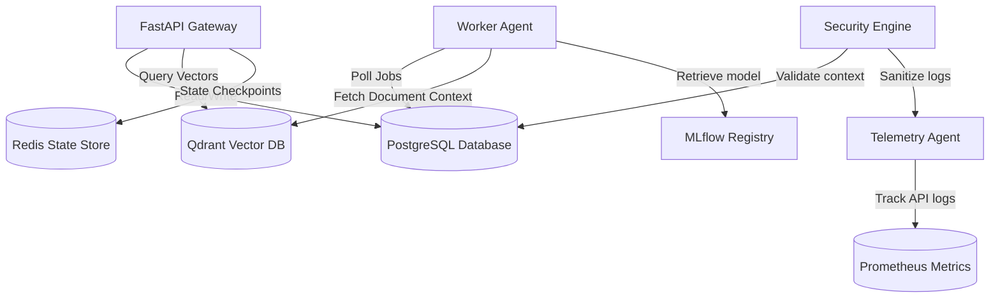

# System Integration Matrix

This document maps all integration channels and dependency relationships between HospitalityAI components.

## 1. Interaction Diagram

## 2. Platform Integrations Catalog

1. **API to Database (SQLAlchemy Async)**:
   - Port: `5432` (TCP).
   - Usage: Query and mutate reservations, guest metadata, security incidents, and user roles.
2. **API to Vector Store (Qdrant REST API)**:
   - Port: `6333` (HTTP).
   - Usage: Fetch semantic chunks using embeddings for RAG contexts.
3. **Agent to Model Store (MLflow Registry API)**:
   - Port: `5000` (HTTP).
   - Usage: Load serialized forecasting models and active prompt template keys.
