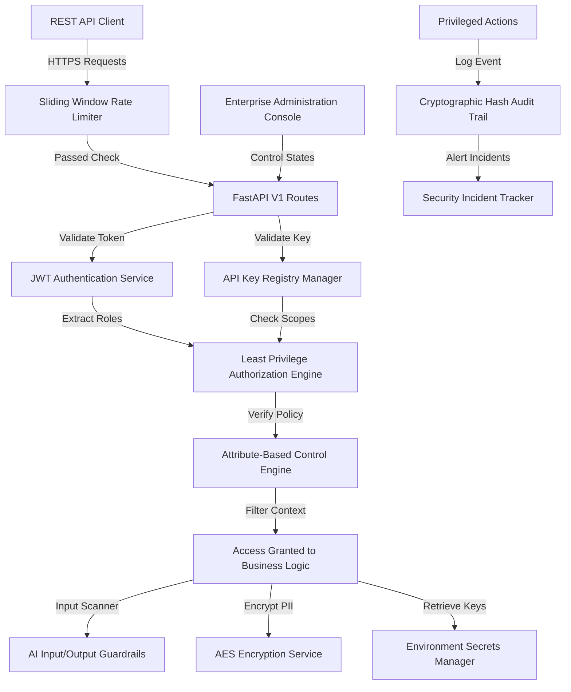

# Security, Identity & Enterprise Administration Console

This directory contains system documentation for the security and identity platform integrated in the Hospitality AI ecosystem.

## Platform Architecture Diagram

## Security Documentation Modules

Select a specific documentation module below for detailed design, guidelines, and APIs:

1. **[Identity & Directory Services](identity.md)**: Standard models for user accounts, API key configurations, and system identities.
2. **[Authentication Services](authentication.md)**: Stateful JWT lifecycle manager, API keys hashing validation registry, and token revocation lists.
3. **[Least Privilege Authorization Engine](authorization.md)**: Direct scope validations, endpoint permissions, and RBAC privilege mappings.
4. **[Attribute-Based Access Control (ABAC)](rbac.md)**: Operational shift hours windows, IP address blacklists, and department isolation controls.
5. **[AI Guardrails & Secrets Protection](ai-security.md)**: Prompt injection/leakage scanners, logging masks, and sliding window API rate limits.
6. **[GDPR Purge & Data Privacy Compliance](compliance.md)**: PII anonymizers, right-to-be-forgotten hooks, and AES field-level encryption.
7. **[Immutable Audit Logging](audit.md)**: Cryptographically chained block verification log entries.
8. **[Enterprise Console & AI Governance](administration.md)**: Model version gate approvals, prompt templates registrations, and maintenance toggles.
9. **[Security Incident Tracker](incident-response.md)**: Incident isolation workflows and containments response metrics.
